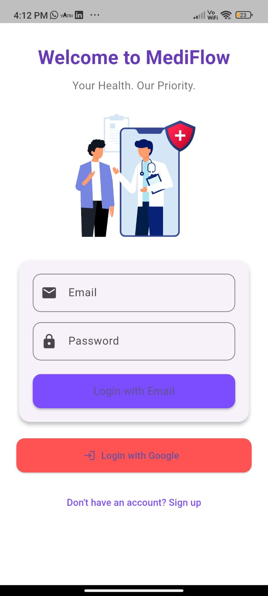
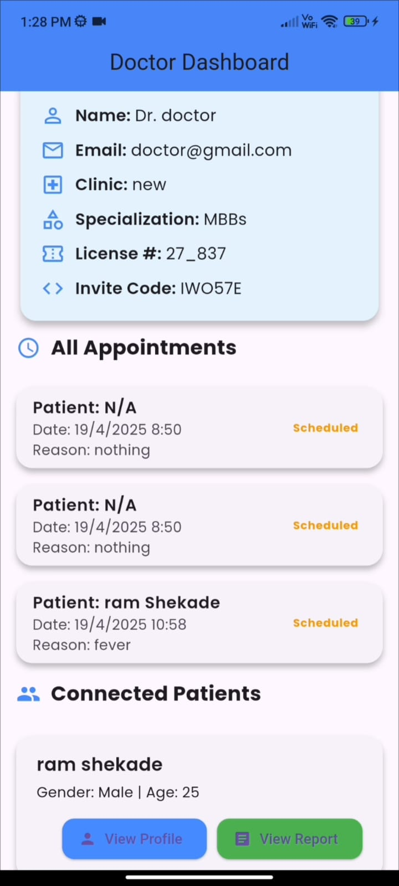
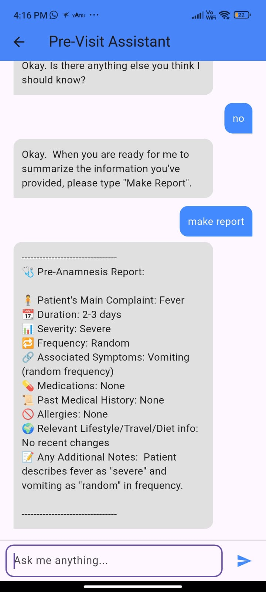

# MediFlow 🩺💬

MediFlow is a smart healthcare assistant mobile application built with Flutter. It helps patients manage their health journey through features like appointment scheduling, pre-visit check-ins, and more. The app also includes an AI-powered assistant to guide users with medical queries and check-ins.

## 📱 Features

- 👤 **User Dashboard**  
  Personalized greeting with profile info and notification updates.

- 💬 **Talk to Assistant**  
  AI-powered voice/text assistant for basic medical interaction.

- 📝 **Pre-Visit Check-In**  
  A chatbot interface for collecting symptoms before a doctor's visit.

- 🗓️ **Appointments**  
  Schedule, view, and manage appointments with doctors.

- 🧾 **Health Records** 
  Upload and manage your personal medical documents securely.

- 🧠 **Therapy Overview**  
  Insights into ongoing treatment or therapy plans.

- 👨‍⚕️ **My Doctor** 
  View and contact your assigned healthcare provider.

## 🔒 Authentication & Storage

- Uses `SharedPreferences` to locally store user data like name, email, profile image URL, and user ID.

## 🧠 AI Assistant

- A custom voice/text chatbot for pre-visit check-ins.
- Voice/audio integration (you can use `just_audio` and `record` packages).

## 📸 Screenshots

<!-- Add your screenshots here -->

| login Screen | Doctor Dashboard | previsit report |
|-------------|-----------|------------------|
|  |  |  |

> 📂 Place your images in the `screenshots/` folder and update the paths.

## 🚀 Getting Started

### Prerequisites

- Flutter SDK
- Android Studio or VSCode
- Dart

### Run the App

```bash
flutter pub get
flutter run
